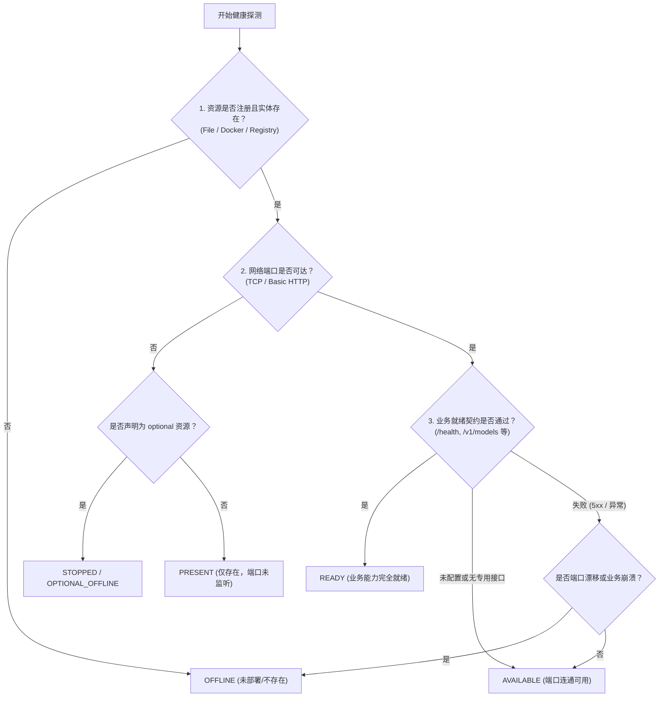

# AI-Hub 健康检查规范 (AI-Hub Health Check Specification)

```text
SPEC_VERSION=V1.0
SPEC_CODE=SPEC-AI-HUB-HEALTH-MODEL-V1
STATUS=ACTIVE
APPLIES_TO=AI Engineering Hub 及所有接入的应用与受管资源
```

---

## 1. 背景与核心三层健康模型

以往各工程组件使用二元或模糊的“UP / DOWN”状态，容易导致：
- 端口监听了，但模型接口因缺少 Token 无法提供推理，误判为正常；
- 容器启动中或已部署，但初始化未就绪，引发连接异常；
- 可选组件（如按需云端隧道）关闭时，导致全局控制面板变红报警。

为彻底消除模糊状态，AI-Hub 确立**统一三层健康检查模型**：

```
+-------------------------------------------------------------------------------+
|                       三层递进健康感知模型 (3-Tier Health Model)               |
+-------------------------------------------------------------------------------+
| 1. 资源存在 (PRESENT)   : 配置已定义，二进制文件 / 本地镜像 / 容器实体已探测存在 |
|           |                                                                   |
|           v                                                                   |
| 2. 服务可达 (AVAILABLE) : TCP 端口成功监听，或基础 HTTP 链路握手返回响应          |
|           |                                                                   |
|           v                                                                   |
| 3. 业务就绪 (READY)     : 业务健康端点 (如 /health, /api/tags, /v1/models) 返回   |
|                          HTTP 200 或功能性就绪信号，具备即时对外提供服务能力     |
+-------------------------------------------------------------------------------+
```

---

## 2. 状态分级与语义契约

| 状态级别 | 语义说明 | 典型场景 | UI 展示 |
| :--- | :--- | :--- | :--- |
| `READY` | **业务就绪**：三层全部通过，可正常提供 AI 推理或业务服务 | Ollama 返回可用模型；AI-KB `/health` 返回 ok | 绿色 Badge (`READY`) |
| `AVAILABLE` | **服务可用**：端口连通，但专用业务健康接口未配置或正处理请求 | 基础设施仅 TCP 端口开放；Web 服务返回 401/405 | 蓝色/青色 Badge (`AVAILABLE`) |
| `PRESENT` | **资源存在**：环境已注册/容器实体存在，但监听端口暂未就绪 | 容器正在启动中；依赖服务已部署但离线 | 灰色 Badge (`PRESENT`) |
| `STOPPED` | **受控停止**：可选资源（如 Cloud CPA 隧道）处于正常待命停机状态 | Cloud CPA 隧道未拉起 | 灰色/橙色 Badge (`STOPPED`) |
| `OPTIONAL_OFFLINE`| **可选离线**：明确声明为 optional 的资源离线，不触发全局警报 | 可选外部中继关闭 | 柔和灰色 Badge (`可选离线`) |
| `OFFLINE` | **不可用/异常**：核心必选服务端口不可通且进程不存在 | 关键数据库关闭；核心应用崩溃 | 红色 Badge (`OFFLINE`) |

---

## 3. 递进式判定逻辑与流程图



---

## 4. 低成本非阻塞探测红线 (Low-Cost Probing)

1. **零算力/Token 损耗**：
   健康探测仅执行轻量级网络握手（TCP Connect、HTTP HEAD/GET `/health`、读取状态快照），**严禁在探测过程中执行真实 LLM 推理、Embedding 或大规模数据扫描**。
2. **毫秒级超时契约**：
   单次探测网络超时上限严格限制在 **1.0 秒以内**；失败立即降级，禁止长连接挂起。
3. **缓存保护机制 (TTL Cache)**：
   探针数据由 Hub 统一维护 15~30 秒 TTL 缓存并支持异步工作线程预热，主请求流程保持 < 50ms 响应，杜绝界面卡顿。
